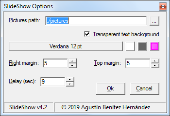

SlideShow Windows Screensaver
=============================

Show photos randomly and includes the metadata (EXIF) text:
  * Title (in upper right of screen) and,
  * Author/date (in the lower right).

 

| Script description   | |
|:---------------------|:----------------------------------------------------|
| **Name:**            |  SlideShow                                          |
| **Version:**         |  4.2                                                |
| **Type:**            |  &#9675; Function  &nbsp; &nbsp; &nbsp;  &#9675; Class  &nbsp; &nbsp; &nbsp;  &#9673; Script |
| **Category:**        |  System (screensaver) / Media (images)                                |
| **wxBasic version:** |  &#9744; 0.6  &nbsp; &nbsp; &nbsp;  &#9745; 2.5  &nbsp; &nbsp; &nbsp;  &#9744; 2.08  &nbsp; &nbsp; &nbsp;  &#9744; 3.2  &nbsp; &nbsp; &nbsp;  &#9744; Console  |
| **OS:**              |  &#9745; Windows  &nbsp; &nbsp; &nbsp;  &#9744; Linux  &nbsp; &nbsp; &nbsp;  &#9744; macOS  |

Remarks
-------

Images can be stored in a local folder (relative or absolute path), e.g.:
  * ./pictutes
  * C:\Users\Agustin\Pictures

or shared from an HTTP or FTP server, e.g.:
  * http://www.media.com/SlideShow/Pictures
  * ftp://ftp.download.net/sldshw/pics
  
Optionally, the image folder can contain several subfolders named **WxH** (e.g., 1600x1200, 1920x1080, etc.), specifying the *width* and *height* of the images in each. The program automatically selects the folder with the aspect ratio and resolution closest to the computer screen and then adjusts the image to full screen. This allows "manual *pan & scan*", without affecting the image composition.

If the resolution subfolders are omitted and the photos are not the same resolution as the screen, the program performs *pan & scan* automatically.

 

The configuration window is accessed by right-clicking on the *.scr* file or from the corresponding button in the system's screensaver settings window:

The options are:

* Image folder local path or URL.
* Transparent or colored text background.
* Font type and size.
* Font and border/background color.
* Text margins relative to the screen edge.
* How long each photo remains on screen

